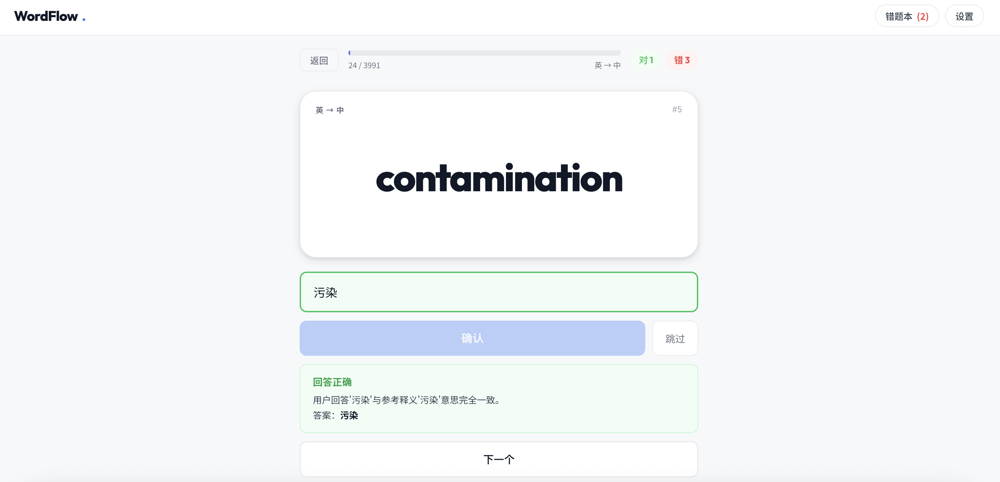
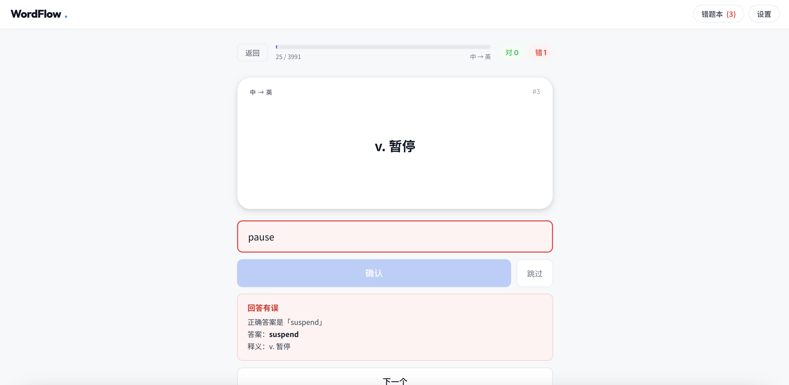

# -
因为做英语阅读的时候很多单词只需要认识就可以了，没有必要完全拼对，所以采用 AI 智能判断中文释义是否正确，不需要与标准答案完全一致。支持初中、高中、四级、六级、考研、托福、雅思、SAT 八本词书，共 35000+ 词汇，错题自动收录重练，每日进度本地保存，关闭网页不丢失。无需注册，打开即用。

网站长这样：

词汇来源
四级 / 六级 / 考研 / 托福 / 高中 / 初中词库来自 [@KyleBing/english-vocabulary](https://github.com/KyleBing/english-vocabulary)
雅思词库来自 [@hefengxian/ielts-vocabulary](https://github.com/hefengxian/ielts-vocabulary)

感谢两位原作者的整理。

本项目免费开源，API Key 已内置供大家使用。  
请不要将其用于背单词以外的用途，感谢你的自觉 ❤️
